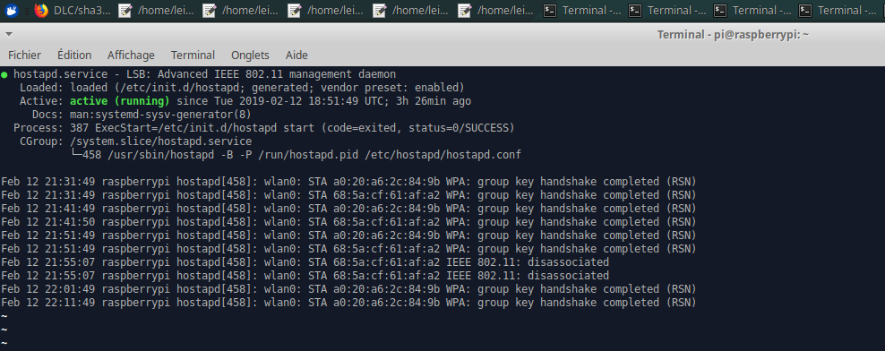
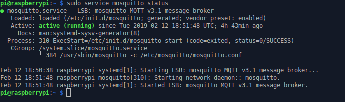
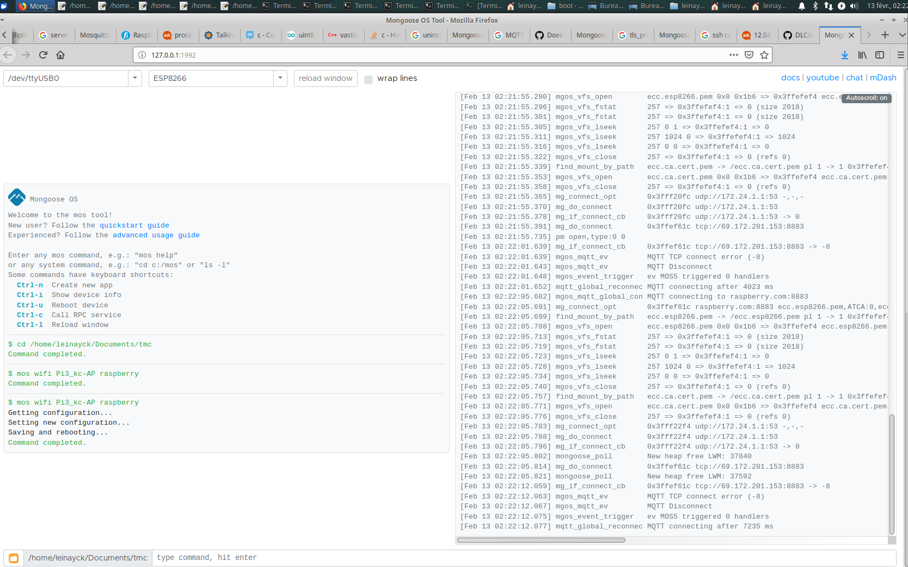
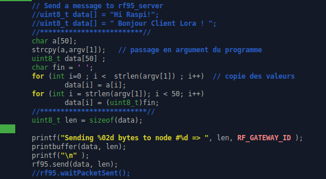

# TMC
Projet 

Objectif du Projet:

Le but du projet est de créer un réseau de capteurs  par Wifi vers un concentrateur .
Nous utiliserons le protocole MQTT pour remonter des mesures vers le concentrateur au travers d’une connexion Wifi.
Dans notre  projet, nous utiliserons de ESP8266 qui joueront le rôle de capteurs et des Raspberry ui joueront le rôle de Concentrateur.  Ces ESP8266 sont munis d’une Wemos.
Chaque capteur utilise la cryptographie à courbes elliptiques pour assurer l’authentification du serveur lors de la connexion SSL et l’authentification client auprès du serveur MQTT.

Pour programmer le  système ESP8266et exploiter le composant ATEC C508A, nous allons utiliser le framwork Mongoose OS.o
Avant de commencer notre implémentation, nous allons mettre en place des configurations de bases.

### RASPBERRY & WIFI

##### Boot réseau du Raspberrry

[]https://www.youtube.com/watch?v=iz_PlsQWNso

##### Configuration du point d’accès Raspberry

Nous avons commencer par  installer et configurer le hostapd et le dnsmasq

Après installation, nous pouvons observer le résultat suivant:

[![Watch the video] https://www.youtube.com/watch?v=qtnUNwkwU_8&feature=youtu.be
##### Configuration du Serveur Mosquitto 

Pour la communication entre nos ESP8266 et notre Concentrateur ( Raspberry) nous avons configurer le serveur Mosquitto sur notre Raspberry.
Test de Fonctionnement de notre serveur

### Generation de certificat/ clées ECC.
En ce qui concerne la configuration des certificats, ils sont été tous déployés au niveau les rapberry et la configuration du 
dns raspberry.com au niveau de la raspiberry.

### Installation de Mongoose OS

1. Connexion au mongoose os  au point d'accès 
Nous avons installer Mongoose OS pour l’utilisation de MQTT.

### Extrait du fichier de Configuration  Lora

### Communication de Lora Client

* Dans un premier temps nous fais un test minimal entre un client rf95 et rf95 serveur Hi Raspi
----illustration vidéo:

*Puis nous avons modifier le programme afin de lui passer en paramètre le message du client rf95 (le but était de lancer un programme depuis un programme python)
** modification rf95_client

 ----illustration vidéo ----

Enfin sur lora pour permettre au raspberry pi de reprendre la main, il nous a fallu commenter une ligne du rf95_client:rf95_.waitPacketSent(), Ce
qui a permis de rendre non bloquant  quand nous lancer un client rf95.

rf95_.waitPacketSent() // Il fallit le debloquer pour rendre la main à la Raspi vcar au départ il prenait    

